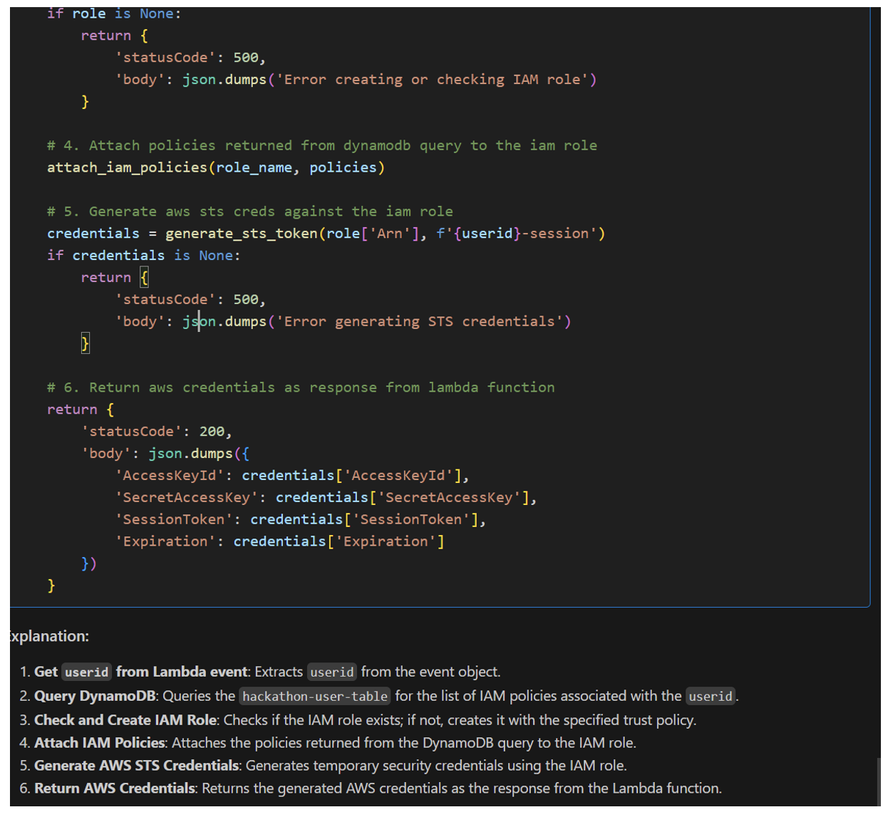
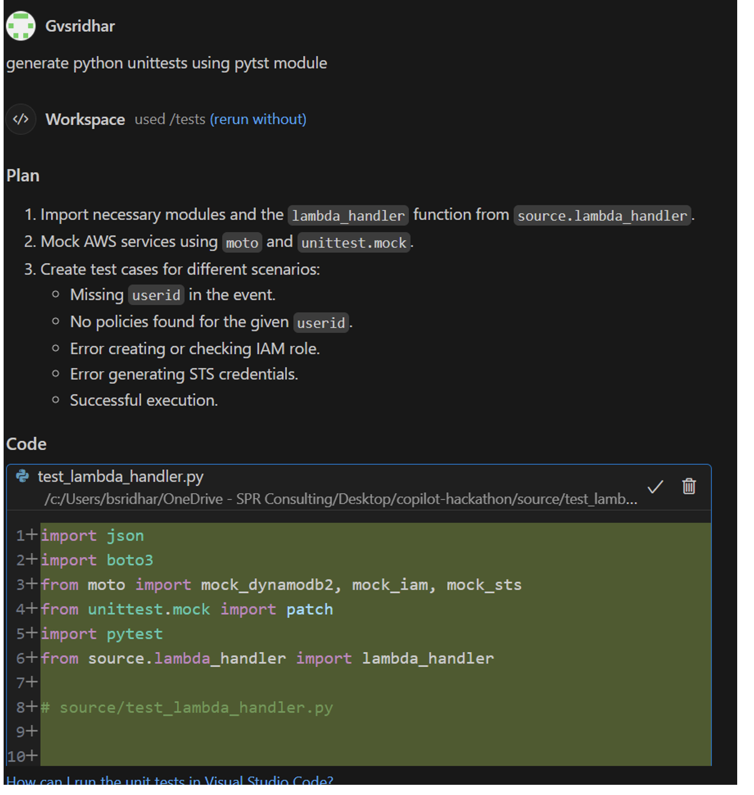

```
Team Name         - Transformers 
Authors           - Venkat, Sandeep, Nagesh, Satya, Ninad

Hackathon Project - Enterprise Data Protection & Access Control 
```

# Objective

As part of this hackathon, we would explore Github Copilot tool with hands-on expereince for code generation and documentation. We would like to evaluate the tool on parameters of learning curve, quality of code generation and document generation and overall productivity improvement. 

We will evaluate the tool for implenting a Compliance practices around data security within enterprise.

# Product Overview ( Enterprise Data Protection & Access Control)

## **Context**

### Why AWS S3 is predominantly used for data storage?
- Well suited for large amount of data ( no limits on data, number of objects)
- Cheaper storage costs ( pay-as-you-go model and cheaper rates for in-frequently accessed data)
- Excellent durability (99.999999999%) and availability (99.9%)

### Challenges with S3 security
- AWS S3 is Global service, hence any misconfiguration on bucket contributes to Risk of unauthorized data access
- Multiple incidents of data breaches on S3 e.g Airline, Ride-share company etc. https://github.com/nagwww/s3-leaks

## What problem we are trying to solve?

We would like to build a robust storage platform on top of AWS S3 which 
- Comply with highest security standards for Data Protection
- Offers secure access pattern to S3 data
- Offers rich UX 

## Solutioning Approach


## What did we build as part of Hackathon?

# How Github-Copilot assisted for implementing solution?

We levergaed Github-Copilot for following tasks during Hackathon project

> IaaC - Infrastructure As A Code

    - Generate Teraform for S3 creation
    - Generate S3 bucket policy with highest restriction clauses
    - Generate IAM role and IAM policy for specific S3 bucket/prefix access
    - Generate Teraform for AWS Lambda code deployment
    - Generate Teraform for AWS API Gateway creation/configuration

> Microservices Development

    - Generating function code for Autherization for AWS credential request
    - Generating function code for dynamically attaching the IAM policy to IAM role and generate temporary AWS creds

**GitHub Copilot Code Generation for AWS Lambda fucntion that does below**

    a.	Get userid from Lambda event passed via AWS PI gateway API calls
    b.	Check if the userid is in dynamodb table and return list of IAM policies user has access to
    c.	Create IAM role for user if it doesn’t exist already
    d.	Attach IAM policies returned by Dynamodb query to IAM role
    e.	Generate SAWS credentials for IAM role using AWS STS
    


**GitHub Copilot Code Generation for AWS Lambda function unit test cases**




> UI Development

    - Generating web application code for temporarily requesting AWS creds from UI


