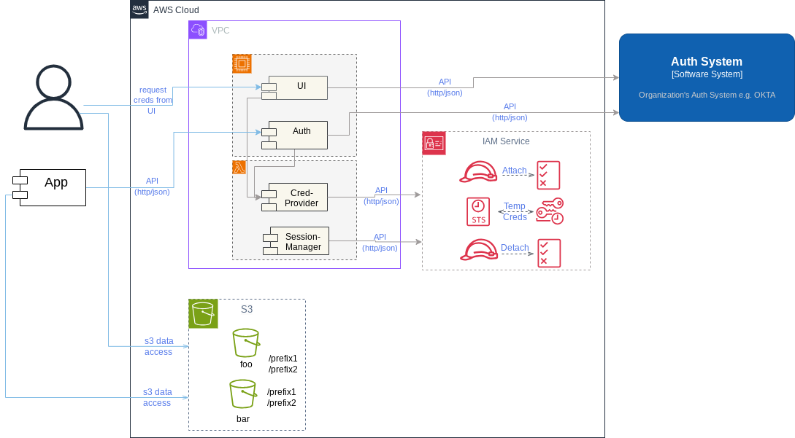
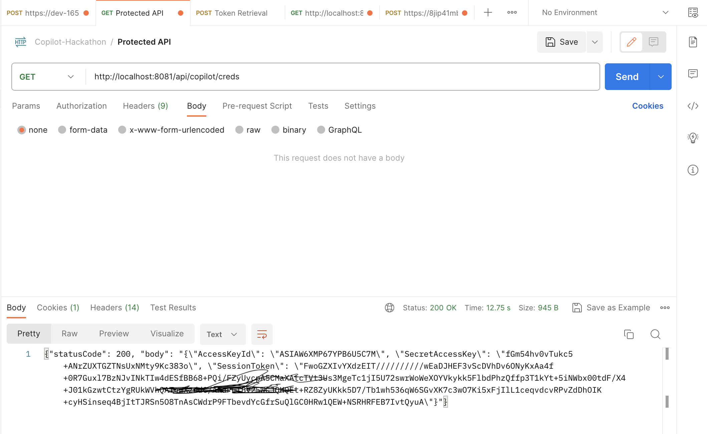

```
Team Name         - Transformers 
Authors           - Venkat, Sandeep, Nagesh, Satya, Ninad

Hackathon Project - Enterprise Data Protection & Access Control 
```

# Objective

As part of this hackathon, we would explore Github Copilot tool with hands-on expereince for code generation and documentation. We would like to evaluate the tool on parameters of learning curve, quality of code generation and document generation and overall productivity improvement. 

We will evaluate the tool for implenting a Compliance practices around data security within enterprise.

# Product Overview ( Enterprise Data Protection & Access Control)

## **Context**

### Why AWS S3 is predominantly used for data storage?
- Well suited for large amount of data ( no limits on data, number of objects)
- Cheaper storage costs ( pay-as-you-go model and cheaper rates for in-frequently accessed data)
- Excellent durability (99.999999999%) and availability (99.9%)

### Challenges with S3 security
- AWS S3 is Global service, hence any misconfiguration on bucket contributes to Risk of unauthorized data access
- Multiple incidents of data breaches on S3 e.g Airline, Ride-share company etc. https://github.com/nagwww/s3-leaks

## What problem we are trying to solve?

We would like to build a robust storage platform on top of AWS S3 which 
- Comply with highest security standards for Data Protection
- Offers secure access pattern to S3 data
- Offers rich UX 

## Solutioning Approach

Solution to provide Controlled Access to S3 buckets and prefix is based on following **Security Principles**

| Security Principle| Control|
|-|-|
|Least Privilege| Separate IAM policies for read-only, read-write and read-write-delete|
|Separateion of Dutieis | Separate IAM policies for each Bucket|
|**Minimize Surface Attack**| **Dyanmically evaluation policy and attach for use, detach after use**|

As depicted in below Architecture diagram, the solution will serve 2 actors for their S3 access needs
- Applications
- Individual Users



Excution Flow is designed in 3 compnents

**Authentication**
1. Application will invoke Auth API which will Authenticate user through organizations's auth system 
2. Individual user will use UI which will authenticate with organizations's auth system (OKTA used for hackathon)

**Credential Provider**
1. App or Individual user will pass authentication token received from previous step while invoking API
2. Credential provider will parse the token to identify user and lookup corresponding IAM role & IAM policies
3. Invoke IAM service to attach the policy to IAM role and generate temporary credential using STS token service

**Session Maintenance**
1. Check for active session and detach IAM policies from IAM role after 1 hour
   
## What did we build as part of Hackathon?

# How Github-Copilot assisted for implementing solution?

We levergaed Github-Copilot for following tasks during Hackathon project

> IaaC - Infrastructure As A Code

    - Generate Teraform for S3 creation
    - Generate S3 bucket policy with highest restriction clauses
    - Generate IAM role and IAM policy for specific S3 bucket/prefix access
    - Generate Teraform for AWS Lambda code deployment
    - Generate Teraform for AWS API Gateway creation/configuration

    

> Microservices Development

    - Generating function code for Autherization for AWS credential request
    - Generating function code for dynamically attaching the IAM policy to IAM role and generate temporary AWS creds
    - Generate Test Cases
    
> UI Development

    - Generating web application code for temporarily requesting AWS creds from UI
    


